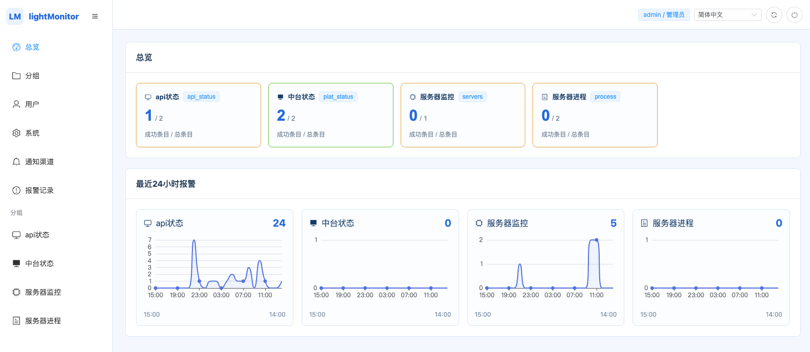

# lightMonitor

lightMonitor 是一个基于 Go、Gin、SQLite 和 Vue3 的轻量级监控系统。不依赖任何第三方组件，将可执行文件启动后即可使用。
系统核心功能基于 **被动数据上报** 和 **主动数据请求** 两种方式收集并分析数据，提供报警与配置管理。

本系统完全使用 AI 编程，完全没有古法手艺，可能存在未知问题，如有发现请提出意见。



## 运行目录

- `data`: SQLite 数据文件
- `log`: 日志文件

## 本地启动

```bash
go run ./cmd/lightmonitor -P 8573
```

首次启动时，访问管理后台即可自动跳转到 `/install` 完成管理员初始化配置。

---

## 系统使用说明

系统主要分为以下模块：
1. **分组设置**：管理监控分组、支持设置“排序”（值越小在菜单栏中越靠前）、缺省数据间隔时间、缺失次数阈值以及用于被动响应的 JSON 格式参数设置。
2. **主动监控**：配置定时向指定 URL 发送 HTTP GET/POST 主动探测数据。
3. **被动监控**：接收客户端数据上报。支持配置字段定义及对应报警规则，当上报数据超过阈值或在指定时间内未成功上报时发送报警通知。

---

## 被动数据上报详解

系统提供全局统一的被动数据上报 API 接口。

### 1. 上报接口
- **URL**: `POST /api/v1/receive`
- **Headers**: `Content-Type: application/json`

### 2. 上报数据格式 (JSON)

上报的 JSON 载荷主要由根条目数据及可选的 `items` 数组批量数据组成：

```json
{
    "group": "分组标记（例如 host）",
    "name": "当前上报条目名称（例如 host-01）",
    "token": "上报要求的全局密钥",
    "timestamp": 1686978405,
    "interval": 60,
    "data": {
        "cpu_load": 1.25,
        "active_users": ["user1", "user2"],
        "containers": [
            {"name": "nginx-web", "cpu": 0.25, "status": "running"},
            {"name": "mysql-db", "cpu": 1.1, "status": "running"}
        ]
    },
    "items": [
        {
            "group": "group_a",
            "name": "device-02",
            "data": { "temp": 36.5 }
        }
    ]
}
```

#### 特色上报机制：
- **批量多条上报**：如果在载荷中传入了 `items` 数组，系统会自动按内容解析并上报数组中的各个子条目（即使根层级的 `group` 和 `name` 均为空）。
- **对象数组处理 (`object_array`)**：
  若在分组的监控字段中将某个字段类型配置为 `object_array`（如上文的 `containers`），且配置了“对应分组”及“条目名称json字段”（如 `name`），当收到数据时，系统会**自动将对象数组中的每一个子元素当做对应分组下的独立监控条目保存并解析**（并在列表中记录并显示上级条目关联）。
- **字符串数组处理 (`string_array`)**：
  上报的数据中支持字符串数组或数字数组。在列表中只显示数组的长度。报警配置支持 `长度=`、`长度>`、`长度<`、`长度!=`、`包含`、`不包含` 等过滤操作符。

### 3. 上报响应格式

```json
{
    "code": 0,
    "msg": "success",
    "data": {
        "interval": 60,
        "setting": {
            "upload_switch": "on",
            "log_level": "debug"
        }
    }
}
```
- **`interval`**：返回该条目要求的上报间隔秒数（如果条目属于某个分组，则返回分组要求的间隔，如果上报条目不存在父级分组，则返回 items 中最后一个正常处理的间隔时长）。
- **`setting`**：返回在后台为该条目或分组设定的键值对参数（条目单独设定则以条目为准，未单独设定则继承自所属分组），便于客户端接收到响应后动态调整策略。

---

## 配套脚本

在 `scripts/` 目录下提供了用于被动数据上报的示例脚本：

- [report_system_metrics.sh](./scripts/report_system_metrics.sh)：多平台兼容的 Linux/macOS 服务器系统监控数据上报脚本（含 CPU、内存、磁盘空间百分比）。

### 使用示例：
```bash
# 单次上报数据
./scripts/report_system_metrics.sh -u http://127.0.0.1:8573/api/v1/receive -g test_group -n host-01

# 以守护进程模式（后台循环）运行，每 60 秒上报一次
./scripts/report_system_metrics.sh -u http://127.0.0.1:8573/api/v1/receive -g test_group -n host-01 -i 60 -D &
```
